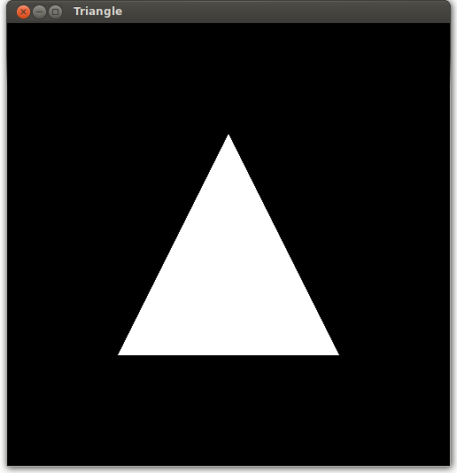
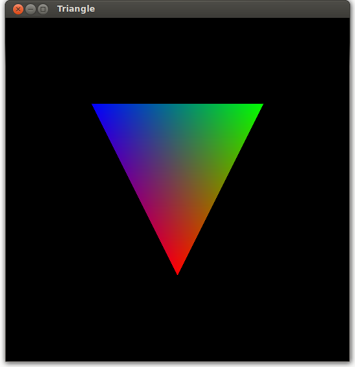
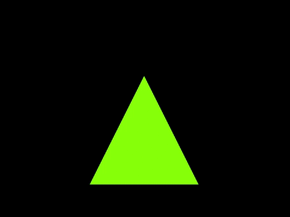
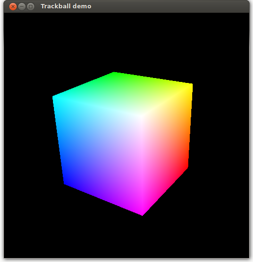

# Assignment 1 - Introduction to OpenGL and shader programming (1TD388/1MD150) 

This assignment will introduce you to graphics programming in OpenGL and the GLSL shading language. During the first lab session, you can also get help from the lab instructors to set up a working development environment for C++ and OpenGL.

The starting code for the model viewer that we will extend for this and the other assignments is available [here](https://github.com/cg-uu/gltf_viewer) on GitHub. If you do not already have the tool Git installed, you can either download it from [here](https://git-scm.com) or install it from your OS's package manager. To clone the model viewer's repository from the command line, run

    git clone https://github.com/cg-uu/gltf_viewer.git

If you have trouble with installing Git, the GitHub website also allows you to download the whole repository as a zip-file. However, we still recommend using Git for version control when working with the assignments.

The deadline for the assignment and further instructions about what parts and files you need hand in to pass are available on the course page in Studium.

 
## General information

This assignment is divided into four parts. Each part requires you to modify the source code in the files `model_viewer.cpp`, `mesh.vert`, and `mesh.frag`.

We will use the cross-platform build system [CMake](http://www.cmake.org/) to generate makefiles for Linux/macOS and Visual Studio solutions for Windows. If you use Windows and Visual Studio Community 2019, you need CMake version 3.14 or higher. Linux and macOS users can also install CMake from a package manager such as `apt` or `brew`. You can find more detailed build instructions for each platform on the GitHub [page](https://github.com/cg-uu/gltf_viewer) for the model viewer.

We shall use the following naming conventions for variables in the GLSL shaders:

    Attribute variables: a_position, a_color, a_normal, ...
    Varying variables: v_position, v_color, v_normal, ...
    Uniform variables: u_color, u_time, ...
    Other variables (local or global): no special prefix

Tip 1: If you use Visual Studio and the GLSL shader files (*.vert and *.frag) are not visible in the solution file tree, open them via the file manager (or drag and drop them into the editor.)

Tip 2: On Windows 10, you can change environment variables by opening the start menu and searching for `Edit environment variables for your account`. On Linux and macOS, you can just set it from the command line, for example to the current directory you are in:

    export MODEL_VIEWER_ROOT=$PWD

Tip 3: You can reload shaders on-the-fly during program execution by pressing `R` (the GLFW window must be in focus). This allows you to edit and debug shader code without having to recompile the C++ host program!

 
## Part 1 - Rendering a triangle

Compile and run the model viewer. By default, the viewer will load the file `triangle.gltf` from the folder `assets/gltf`. If you see a white triangle on a black background, it means that your hardware and drivers support OpenGL 3.3 and GLSL 3.30! If you only see a black window or a screen full of error messages, it usually means that something went wrong during the compilation process, or that you did not set the `MODEL_VIEWER_ROOT` environment variable correctly (a common mistake). If this happens, ask us for help during the lab session. It might also be that your system does not support OpenGL 3.3, in which case you should try on another computer or a different OS.

Browse through the source code in `model_viewer.cpp`, `mesh.vert`, and `mesh.frag` and try to figure out what the different parts of the code does. Then, complete the following tasks:

- Change the color of the background by modifying the arguments to [glClearColor()](http://docs.gl/gl3/glClearColor). You can also try to change the size of the window by modifying the width and height variables.
- Change the color of the triangle by modifying the `vec4` vector assigned to `frag_color` in the fragment shader `mesh.frag`. This variable determines the output color of the processed fragment. It is a vector with four components (red, blue, green, alpha), where each component has a value between 0.0 and 1.0.
- `gl_Position` is a built-in variable that determines the output position (x, y, z, w) of the processed vertex. The current version of triangle.vert just sets `gl_Position` to the incoming vertex position a_position. What happens if you instead set `gl_Position` to vec4(-a_position.xyz, 1.0)?

You may wonder why `a_position` and `gl_Position` are 4D vectors when the objects we render are two- or three-dimensional. The lectures about viewing and transformations will explain this, but for now you can just ignore the fourth component and set it to 1.0.

 
## Part 2 - Varying variables and vertex attributes

Instead of defining the output color in the fragment shader, pass the color as a varying `vec3` variable (call it `v_color`) from the vertex shader to the fragment shader using the out qualifiers. You may look in the slides from the second lecture of the course for examples how you should declare new varying variables.

So far, you have rendered triangles by fetching only a single attribute (position) from the vertex buffer. Open the file `gltf_render.cpp` and look in the function `create_drawables_from_asset()` how the vertex format of the vertex buffer is specified. To enable a second attribute (color), in the vertex shader, declare a new input variable a_color similar to `a_position`, but with a different location index (look in `gltf_render.h` for this index value). Finally, access `a_color` in `main()` in the vertex shader and set `v_color` to `a_color`. What happens with the colors when they are passed to the fragment shader?

 
## Part 3 - Uniform variables and animation

The `draw_scene()` function in `model_viewer.cpp` fetches the elapsed time (in seconds) since program startup and passes it as a uniform float variable (`u_time`) to the shaders.

Experiment with using the uniform time variable and some trigonometric GLSL function (i.e., sin or cos) to manipulate the color of the triangle so that it, e.g., pulsates or fades from bright to dark. You may also try to use the time variable to scale or move the triangle.

## Part 4 - Spinning RGB cube

In this final part, we will load a scene with another model, `cube_rgb.gltf`, to render a unit cube whose vertices are color mapped to the RGB color space. If you are not already familiar with the RGB color model, you can read about it here: http://en.wikipedia.org/wiki/RGB_color_model

To load a different glTF scene, change the filename in the variable `gltfFilename` in the Context struct from `triangle_rgb.gltf` to `cube_rgb.gltf`. Note that you can also provide a filename as argument to the application via the command line.

Since only one side of the cube is visible, we will add interaction with a virtual trackball to allow a user of the program to spin the cube with the mouse. The implementation of the trackball can be found in `cg_trackball.cpp`. You can also look in `model_viewer.cpp` to see how the mouse input events from GLFW are handled.

In `draw_scene()` in `model_viewer.cpp`, create a new variable for the rotation matrix from the trackball

    mat4 view = glm::mat4(ctx.trackball.orient);

After declaring a corresponding uniform variable `u_view` of same type in the vertex shader, you also need to pass the uniform mat4 value to the shader with

    glUniformMatrix4fv(..., 1, GL_FALSE, &view[0][0]);

Finally, apply the rotation to the cube by multiplying `a_position` with the new matrix when computing the output position in the vertex shader.

You might notice that the rotation from the trackball seems a bit inverted. This is because we have not yet set up a proper projection matrix for the viewing. We will fix this in the next assignment when looking more at viewing and different transformations!
